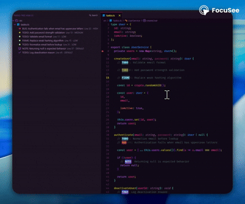

# Taskio – TODO Comments as Tasks for VS Code

Turn TODO, FIXME and BUG comments into **real, actionable tasks** inside Visual Studio Code.

**Taskio** scans your codebase for TODO-style comments and transforms them into a centralized **task list**, helping developers track pending work without leaving the editor.

<div align="center">



</div>

---

## Features

- 🔍 Automatically detects `TODO`, `FIXME` and `BUG` comments  
- 🌳 Displays all tasks in a dedicated **Tree View**  
- ⚡ Fast search across TODO comments  
- 🎯 Task priorities using markers (`!`, `!!`, `!!!`)  
- 🎨 Customizable highlight colors and behavior  
- 🪶 Lightweight and fast (no performance impact)

---

## How It Works

Taskio continuously scans your workspace for comment keywords and keeps them organized in a task tree.

No setup required — install and start writing TODOs.

---

## Supported Keywords

By default, Taskio detects the following keywords:

- `TODO`
- `FIXME`
- `BUG`

You can fully customize this list in the extension settings.

---

## Customization

Taskio can be configured via the VS Code **Settings UI** or directly in `settings.json`.

### Example configuration

```json
{
  "taskio.keywords": ["TODO", "FIXME", "BUG"],
  "taskio.color": "#6042f5",
  "taskio.enhanceAllText": false,
  "taskio.priorityMarkers": {
    "high": "!!!",
    "medium": "!!",
    "low": "!"
  }
}
```

### Configuration options

- **`taskio.keywords`**  
  Defines which comment keywords are recognized as tasks.

- **`taskio.color`**  
  Sets the highlight color used to mark tasks in the editor.

- **`taskio.enhanceAllText`**  
  Highlights the entire comment line instead of only the keyword.

- **`taskio.priorityMarkers`**  
  Defines how task priority is detected using repeated characters.

---

## Priority Markers

You can define task priority directly in your comments using exclamation marks:

- `!` → Low priority  
- `!!` → Medium priority  
- `!!!` → High priority  

### Example

```ts
// TODO! Refactor this function
// FIXME!! Handle edge cases
// BUG!!! Crashes on startup
```

Higher priority tasks are visually distinguished in the task tree and search results.

---

### ⭐ Enjoying Taskio?
If Taskio helps you stay productive, consider leaving a ⭐ review on the VS Code Marketplace — it really helps!
