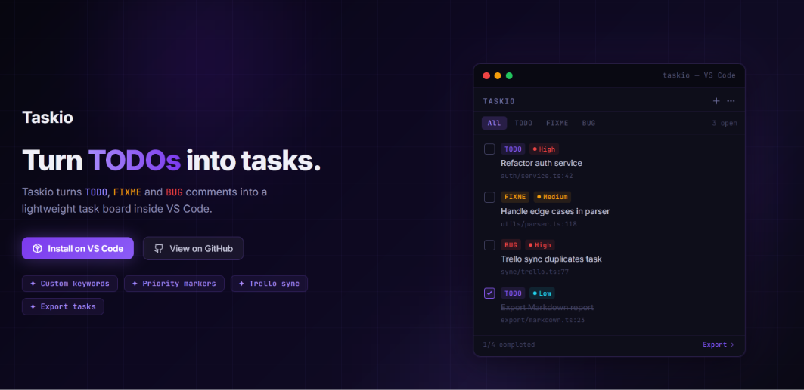
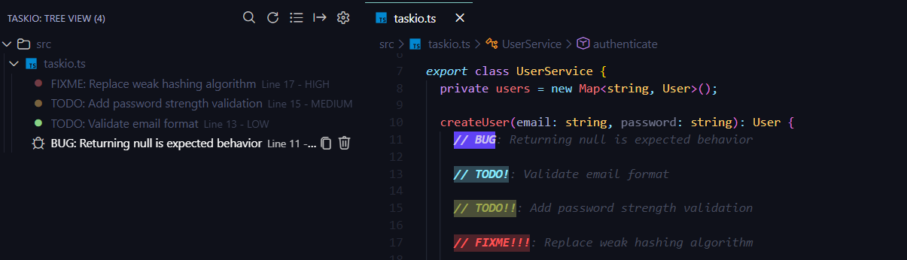
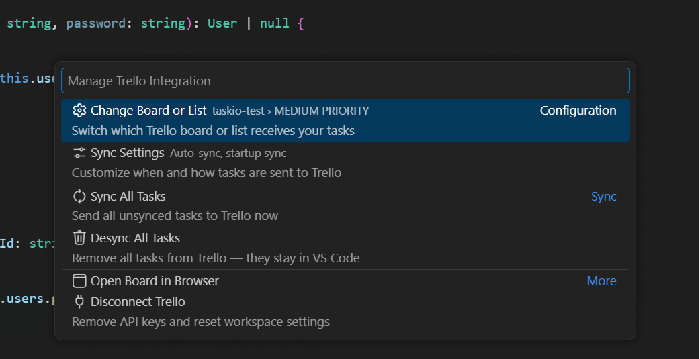
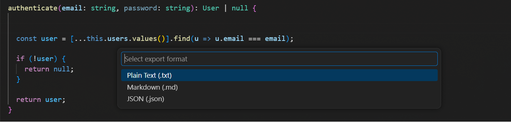

# Taskio

Turn `TODO`, `FIXME` and `BUG` comments into an organized task board inside VS Code.

Taskio helps you keep technical debt visible without leaving your editor. It scans your workspace, groups code comments by priority, file or folder, and lets you search, export or send tasks to Trello in a few clicks.

No setup required for the core workflow. Install Taskio and start organizing the comments already living in your codebase.

<div align="center">
  <a href="https://marketplace.visualstudio.com/items?itemName=taskio.taskio">
    
  </a>
</div>

---

## Features

* Detect `TODO`, `FIXME` and `BUG` comments automatically
* Add custom keywords to match your workflow
* View all tasks in a dedicated VS Code Tree View
* Search tasks across the entire workspace
* Set priorities with `!`, `!!` and `!!!` (customizable)
* Group tasks by priority, file or folder
* Export tasks to JSON, Markdown or TXT
* Customize highlight color
* Send tasks to Trello with optional integration

---

## Why Taskio?

Code comments are where technical debt often hides.

Taskio makes those comments visible, searchable and easier to act on. Instead of losing important notes across source files, you get a lightweight task board built directly into VS Code.

<div align="center">
  
</div>

---

## Custom Keywords and Priorities

Taskio detects `TODO`, `FIXME` and `BUG` by default, but both the keywords and priority markers are fully customizable on extension settings.

```ts
// TODO! Refactor this function
// FIXME!! Handle edge cases
// BUG!!! Crashes on startup
```

Default priority markers:

* `!` Low
* `!!` Medium
* `!!!` High

---

## Trello Integration

Taskio can send code tasks to Trello so they can move into your existing workflow.

Trello cards can include the task description, file path, line number and task metadata.

<div align="center">
  
</div>

---

## Export Tasks

Export your tasks when you need to share, document or review them outside VS Code.

Supported formats:

* JSON
* Markdown
* TXT

Exported tasks include the file path, line number, priority and clean task description.

<div align="center">
  
</div>

---

## Commands

Taskio includes commands for searching, refreshing, grouping, exporting, copying, removing and sending tasks to Trello.

Main commands:

* `Taskio: Search Tasks...`
* `Taskio: Refresh`
* `Taskio: Change Grouping Mode`
* `Taskio: Export Tasks`
* `Taskio.Trello: Send to Trello`
* `Taskio.Trello: Open in Trello`

---

## Settings

Taskio can be configured from the VS Code Settings UI or directly in `settings.json`.

```json
{
  "taskio.keywords": ["TODO", "FIXME", "BUG"],
  "taskio.color": "#6042f5",
  "taskio.enhanceAllText": false,
  "taskio.priorityMarkers": {
    "high": "!!!",
    "medium": "!!",
    "low": "!"
  }
}
```

---

## Best For

* Developers who use comments to track work
* Teams that want to make technical debt more visible
* Projects with scattered TODO, FIXME or BUG notes
* Anyone who wants a lightweight task board inside VS Code

---

## Feedback

If Taskio helps you stay organized, leaving a review on the VS Code Marketplace really helps the project grow. :)
